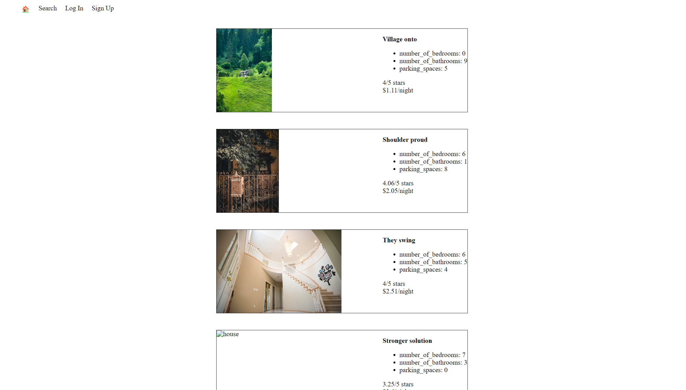
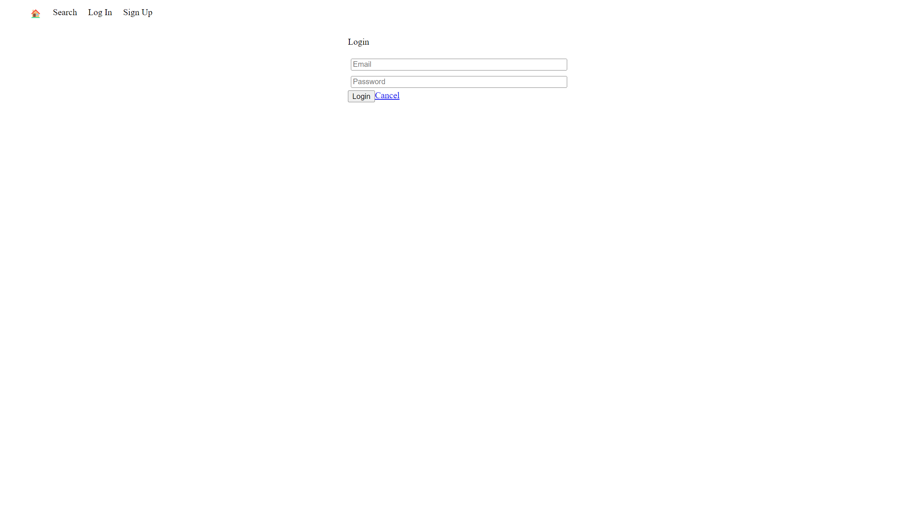
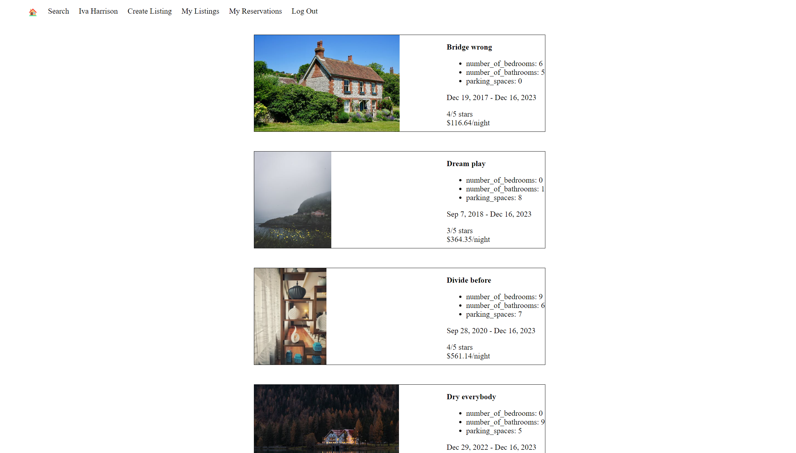
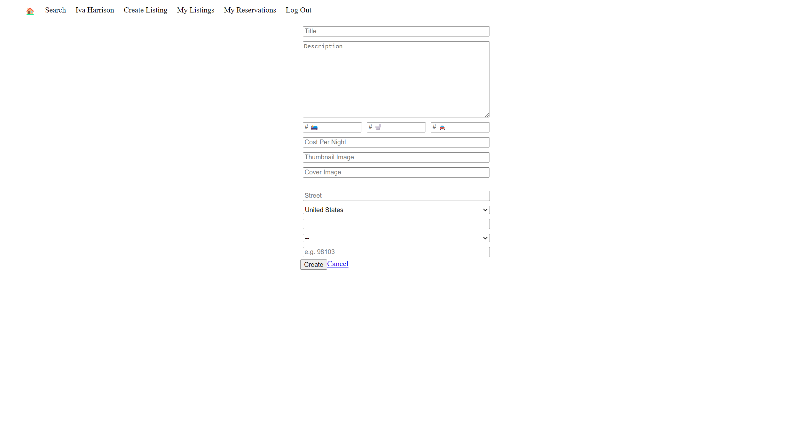
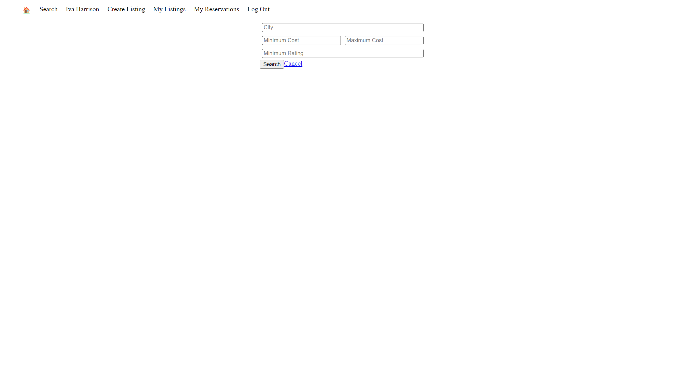

# LightBnB
A simple AirBnB clone made during the Lighthouse Labs Web Development Flex program to learn about PostgreSQL, SQL queries, database structure, and communication.

## Features
* Ability to create an account, log in, and sign out.
* Ability to create a new property.
* Ability to filter searches.
* Uses query variables to prevent database manipulation.

## Initial Setup
* Download the project files.
* Run `npm install` to install project dependencies.
* Change `Pool` settings at the top of `database.js` as needed.
* Start postgres from within the project folder.
* From within the terminal, run the following commands:
  * `CREATE DATABASE lightbnb`
  * `\c lightbnb`
  * `\i migrations/01_schema.sql`
  * `\i seeds/01_seeds.sql`
  * `\i seeds/02_seeds.sql`
* Start the server by using `npm run local` from within the WebApp folder.
* Go to `localhost:3000` from within your browser.
* Create an account!
  * Alternatively, log in to an existing account to see their reservations:
    * `Email: allisonjackson@mail.com`
    * `Password: password`

## Images

## ERD
![An image of the project's ERD. It shows the following: A green rectangle labelled properties containing a primary key of "id", a foreign key of "owner_id", title, description, thumbnail_photo_url, cover_photo_url, cost_per_night, parking_spaces, number_of_bathrooms, number_of_bedrooms, country, street, province, city, postal_code. A blue rectangle labelled as "peropty_reviews", containing a primary key of "id", a foreign key of "guest_id", a foreign key of "property_id", a foreign key of "reservation_id", rating, and message. A pink rectangle labelled as "users", containing a primary key of "id", name, email, and password. An orange rectangle labelled as "reservations" containing a primary key "id", a foreign key "property_id", a foreign key "guest_id", start_date, and end_date.](./images/erd.png)